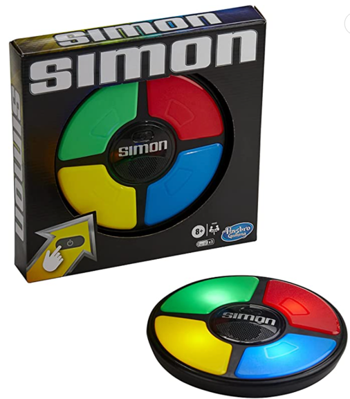

# Super-Simon

## Régles

**Simon** est un jeu de société électronique de forme circulaire comportant quatre grosses touches de couleurs différentes, rouge, vert, bleu et jaune.

Le jeu, électronique, éclaire une des quatre couleurs et produit un son toujours associé à cette couleur.

Le joueur doit alors appuyer sur la touche de la couleur qui vient de s'allumer dans un délai assez court.

Le jeu répète la même couleur et le même son, puis ajoute au hasard une nouvelle couleur.

Le joueur doit reproduire cette nouvelle séquence.

Chaque fois que le joueur reproduit correctement la séquence, le jeu ajoute une nouvelle couleur.

## Améliorations possibles

- Design plus joli
- Jeu à 2 joueurs
- Mémorisation des scores en LocalStorage
- Amélioration du référencement

## Dépendances

Tailwind
## Source

Justine Martin
https://github.com/justine-martin-dev/SuperSimon
